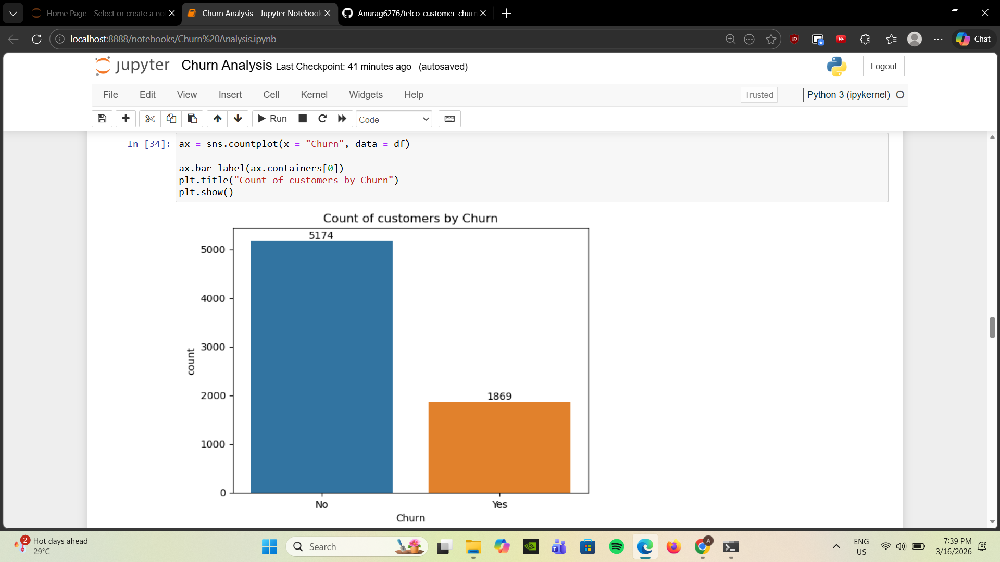
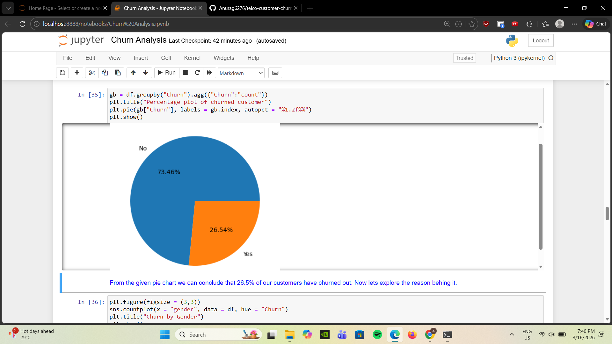
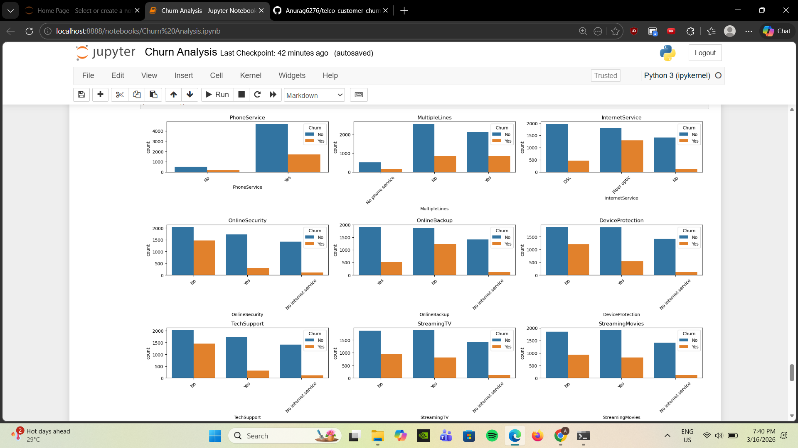

# Telco Customer Churn Analysis

## Project Overview

This project explores customer churn in a telecom company using data analysis techniques. The goal is to understand the factors that influence why customers leave the service and identify patterns that can help the company improve customer retention.

## Dataset

The dataset contains information about customers such as demographics, services they subscribe to, and billing details. It was loaded into the notebook using pandas and explored to understand the structure and quality of the data.

## Analysis

The analysis was performed using Python libraries such as pandas, matplotlib, and seaborn. Exploratory data analysis was conducted to examine how different services like internet service, tech support, security, and streaming options relate to customer churn.

Visualizations such as count plots were used to observe patterns and compare churn behavior across different services.

## Key Insights

The analysis shows that customers who do not subscribe to support-related services such as online security, online backup, and tech support tend to churn more frequently. Fiber optic internet users also show a relatively higher churn rate compared to other service types.

## Conclusion

The results suggest that service reliability and support features play an important role in retaining customers. Providing additional support services and improving overall service quality can help reduce churn and improve long-term customer relationships.

## Some screenshots from the notebook

